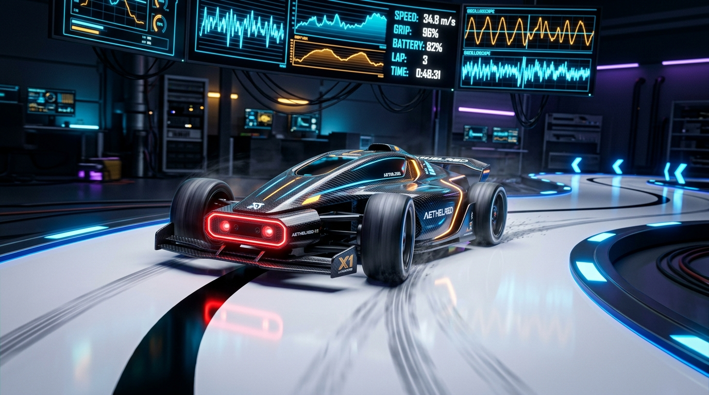
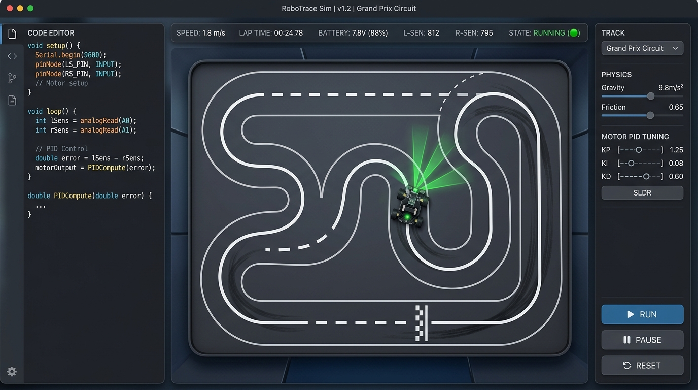
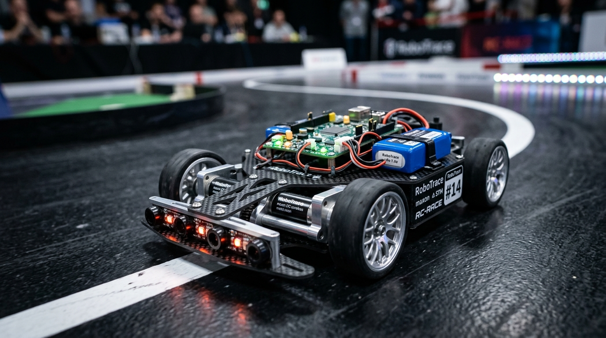

<p align="center">
  
</p>

<h1 align="center">🏎️ Line Robot Simulator (Robot Race Sim)</h1>

<p align="center">
  <b>Professional physics-based simulator and development environment for high-speed Line Follower / RoboTrace competitive robots</b>
</p>

<p align="center">
  <a href="#-key-features">Features</a> •
  <a href="#-interface-demonstration">Interface</a> •
  <a href="#-hardware--physics-model">Physics & Hardware</a> •
  <a href="#-authentic-arduino-c-code-execution">Arduino C++</a> •
  <a href="#-race-tracks">Tracks</a> •
  <a href="#-quick-start">Quick Start</a> •
  <a href="README.md">Русская версия 🇷🇺</a>
</p>

<p align="center">
  
  
  
  
  
  
</p>

---

## 📸 Interface Demonstration

<p align="center">
  
</p>

> **Ergonomic, modern, dark-themed UI**:
> - 📝 **Left Panel:** Built-in Arduino C++ editor with syntax highlighting, line numbers, and fast live compilation (`Ctrl + Enter`).
> - 🏁 **Center Arena:** 60 FPS physics canvas with dynamic tire slip, IR sensor ray tracing, trajectory breadcrumbs, and a single **[ ▶ Start Robot ]** button.
> - 📊 **Top Bar:** Non-obstructive telemetry display (real-time velocity, lap timer, status, IR sensor values) - keeping the race track view 100% unobstructed!
> - ⚙️ **Right Panel:** Detailed engineering tuning panel (mass, motor RPM, track width, wheel diameter, sensor overhang, LiPo cell voltage).

---

## ✨ Key Features

### 🔌 Smart Pinout & Code Architecture Analyzer
* **Arbitrary Code Upload & Drag-and-Drop**: Drag any `.ino`, `.cpp`, or `.h` file directly onto the editor or use the **"Upload"** button.
* **Automated Motor Driver Topology Detection**:
  - **TB6612FNG**: recognition of `PWMA, AIN1, AIN2` and `PWMB, BIN1, BIN2, STBY`.
  - **L298N / L293D**: recognition of `ENA, IN1, IN2` and `ENB, IN3, IN4`.
  - **DRV8833 / MX1508**: dual-PWM differential motor control.
  - **PWM + DIR**: discrete speed and direction pins.
  - **ESP32 LEDC**: hardware PWM channels via `ledcWrite()`.
  - **Custom Function Hooks**: automatic detection of `setMotors()`, `motors()`, `drive()`, `motorLeft()`, `motorRight()`.
* **Sensor Pinout Auto-Mapping**:
  - Detects pin arrays (`int sensorPins[] = {A0, A1, A2, A3, A4}`), individual `#define S1..S8`, or calls to `analogRead(A0..A15)` / `digitalRead()`.
  - **One-Click Chassis Sync**: If uploaded code specifies 5 sensors while the simulator has 8, an instant `[⚡ Sync Chassis (5 sensors)]` button appears to synchronize hardware geometry!
* **Full Pololu `QTRSensors` Emulation**:
  - Built-in support for `QTRSensors` class, `qtr.readLineBlack()`, `qtr.readLineWhite()`, `qtr.calibrate()`, and `qtr.setSensorPins()`.

### 1. 💻 Authentic Arduino (C++) Code Execution
* **Complete Virtual GPIO Table**: `digitalWrite()`, `analogWrite()`, `digitalRead()`, `analogRead()`, and `pinMode()` operate realistically on virtual hardware pins.
* **1:1 syntax compatibility**: write native `setup()`, `loop()`, `pinMode()`, `analogRead()`, `millis()`, `constrain()`, `map()`, and `Serial.println()`.
* **Motor control**: `setMotors(left, right)` or `setMotorA()`, `setMotorB()` from `-255` to `+255`, as well as direct hardware PWM.
* **Pololu QTR sensor centroid algorithm**: `readLineBlack(sensorValues)` calculates the weighted line center between `0` and `(N-1)*1000`.
* **State persistence across iterations**: global variables (`lastError`, `integral`, user timers) persist between `loop()` iterations just like on a real MCU (ESP32-S3, STM32, Arduino).

```cpp
// Competitive PID Line Follower Example in C++
#define BASE_SPEED 180
#define MAX_SPEED 255

float Kp = 0.085;
float Kd = 1.45;
int lastError = 0;

void loop() {
  int sensorValues[8];
  int position = readLineBlack(sensorValues);
  int error = position - 3500; // Line center for 8-sensor array (0..7000)

  int motorSpeed = Kp * error + Kd * (error - lastError);
  lastError = error;

  setMotors(BASE_SPEED + motorSpeed, BASE_SPEED - motorSpeed);
}
```

---

## 🛠️ Hardware & Physics Model

<p align="center">
  
</p>

Simulates real mechanical and electrical characteristics of competitive **RoboTrace / Line Follower** chassis:

| Subsystem | Tunable Parameters | Impact on Physics & Performance |
|:---|:---|:---|
| **Chassis Geometry** | Wheelbase ($45$ – $140$ mm), wheel diameter ($20$ – $70$ mm), tire width ($5$ – $25$ мм) | Agility, minimum turning radius, roll stability |
| **Tire Traction (Grip)** | Friction coefficient $\mu$ ($0.8$ – $1.8+$): rubber, silicone, sticky polyurethane | Maximum cornering speed without centrifugal slip |
| **Powertrain** | Motor RPM $300$ – $3500$, battery voltage 1S–4S LiPo ($3.7$ – $14.8$ V) | Acceleration rate, top straightaway speed, braking torque |
| **Sensor Bar** | $3, 5, 8, 12, 16$ IR sensors, overhang distance ($20$ – $120$ mm), sensor pitch ($4$ – $22$ mm) | Lookahead distance, reaction time, and precision |
| **Mass & Inertia** | Weight from $50$ to $350$ g with calculated moment of inertia $J$ | Lateral momentum when entering sharp chicanes and hairpins |

---

## 🏎️ Built-in Chassis Presets

| Preset | Motors | Battery | Sensors | Mass | Use Case |
|:---|:---:|:---:|:---:|:---:|:---|
| **⚡ Pro Racing Chassis** | 1500 RPM | 2S LiPo (7.4V) | 8x QTR | 120 g | Optimal tournament balance of speed and control |
| **🏆 Speed Monster** | 3000 RPM Coreless | 3S LiPo (11.1V) | 12x QTR | 95 g | Extreme speed designed for wide sweeping curves |
| **🔰 Beginner Friendly** | 600 RPM N20 | 1S LiPo (3.7V) | 5x QTR | 150 g | Reliable baseline for tuning basic P-controllers |
| **🧱 Lego / Heavy Tandem**| 350 RPM | 7.4V | 3x QTR | 280 g | High-inertia educational robots |

---

## 🏁 Race Tracks

1. **🔄 Classic Oval** — baseline calibration of $K_p$ and top cruising speed.
2. **〰️ Slalom** — continuous succession of smooth S-curves with variable radius.
3. **📐 Sharp 90° Turns** — stress-testing corner spin-turns and line recovery routines.
4. **🪃 Hairpin 180° & Chicane** — high-speed straightaway leading into sudden heavy braking.
5. **♾️ Figure 8 (Infinity)** — intersecting line crossing and alternating cornering loads.

---

## 🎮 Controls & Shortcuts

* **[ ▶ Start Robot ] / [ ⏸ Pause ]** — single primary control button on the arena toolbar.
* `Space` — global run / pause toggle.
* `R` — instant reset to start line + reset lap timers.
* `Ctrl + Enter` — compile and apply code immediately.
* **Click & Drag** — reposition robot anywhere on the canvas with custom heading.

---

## 🚀 Quick Start

### Option 1: Standalone Windows App (No Node.js Required)
1. Double-click the launch helper:
   ```cmd
   Запустить_Симулятор.bat
   ```
2. Or directly launch `release\win-unpacked\Line Robot Simulator.exe`.

### Option 2: Run from Source
Requires [Node.js](https://nodejs.org/) (v18 or newer):

```bash
# 1. Clone repository
git clone https://github.com/hegoleg/robot-race-sim.git
cd robot-race-sim

# 2. Install dependencies
npm install

# 3. Start web development server
npm run dev

# 4. Or launch as desktop Electron app
npm run electron:dev
```

### Build Windows Installer (.exe):
```bash
npm run build
```
The installer executable will be generated inside the `release/` folder.

---

## 📄 License

This project is licensed under the [MIT](LICENSE) license.
